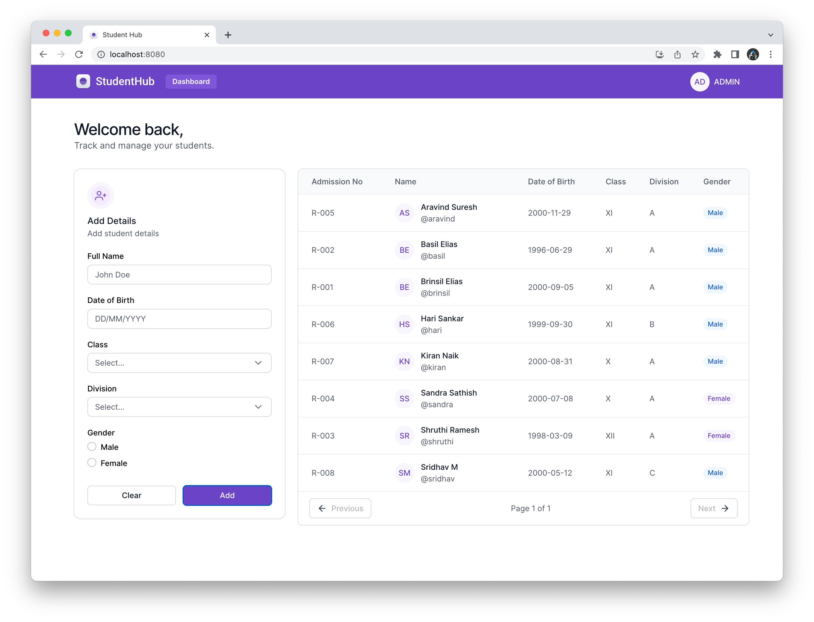
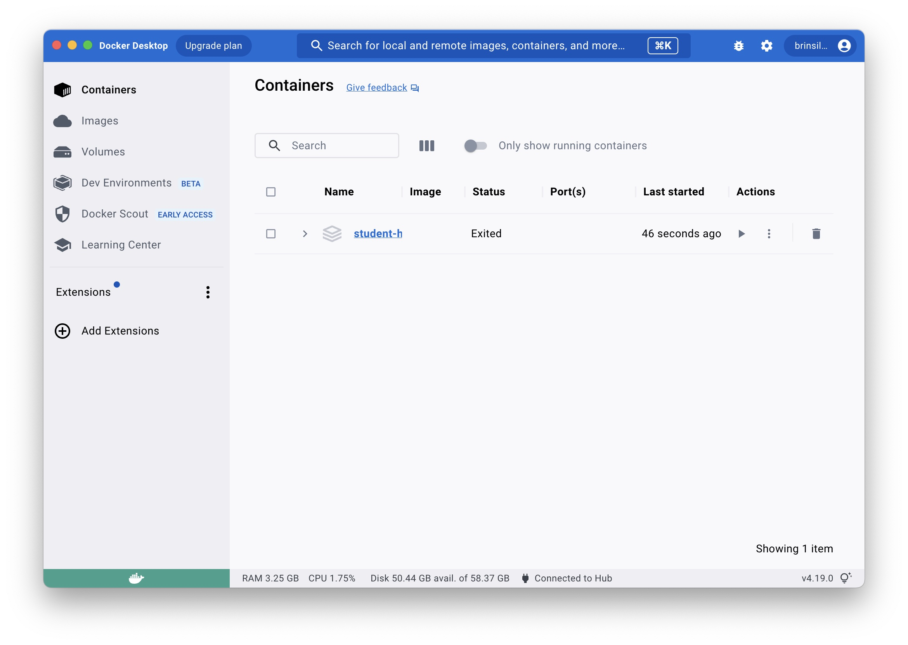
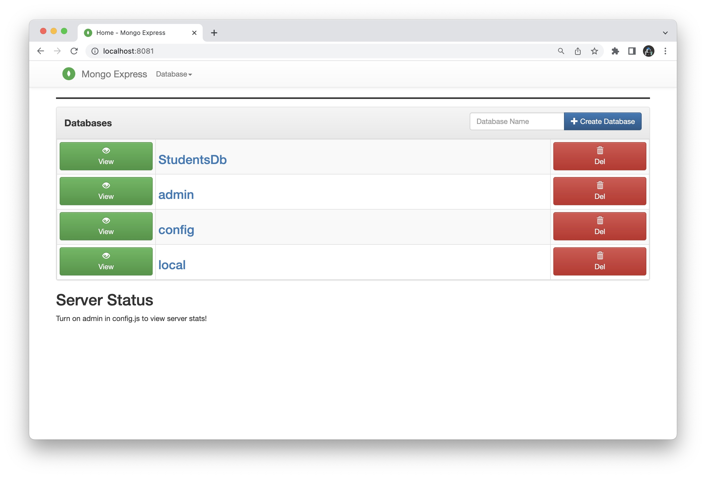

# StudentHub

  <a href="#">About The Project</a>&nbsp;&nbsp;&nbsp;|&nbsp;&nbsp;&nbsp;
  <a href="#">Technologies</a>&nbsp;&nbsp;&nbsp;|&nbsp;&nbsp;&nbsp;
  <a href="#">Requirments</a>&nbsp;&nbsp;&nbsp;|&nbsp;&nbsp;&nbsp;
  <a href="#">Installation</a>&nbsp;&nbsp;&nbsp;|&nbsp;&nbsp;&nbsp;
  <a href="#">Running the Project</a>

---

## 🚀 About the Project

 StudentHub provides a dashboard that enables effective tracking and management of Students. The dashboard will have a form and a table. The users can add student details using the form and track and manage the details in the table.

---
## 💻 Technologies
- [React](https://react.dev/learn)
- [Springboot](https://spring.io/projects/spring-boot)
- [Mongo-Express](https://github.com/mongo-express/mongo-express) 
- [Docker](https://www.docker.com/)

---
## 🧰 Requirements

For development, you will need the following software and packages installed in your environment.

### Java
- Java version "openjdk version "20.0.1" 2023-04-18
- OpenJDK Runtime Environment (build 20.0.1+9-29)
- OpenJDK 64-Bit Server VM (build 20.0.1+9-29, mixed mode, sharing)

### Docker
- [Docker Desktop](https://www.docker.com/products/docker-desktop/)

### Maven
- Maven 3.9.2

---

## ⚙️ Install
### Windows
1. Install Java by downloading the installer from the official website.
2. Install Docker by downloading the installer from the official website.
3. Install Maven by downloading the binary distribution from the official website and extracting it to a desired location.

### Unix-based OS (e.g., Ubuntu)
1. Install Java by running the following commands:

        $ sudo apt update
        $ sudo apt install openjdk-20-jdk

2. Install Docker by following the instructions for your specific distribution.
3. Install Maven by running the following commands:

        $ sudo apt update
        $ sudo apt install maven

---

## Running the Project

1. Clone the repository:

        $ git clone https://github.com/BrinsilElias/student-hub.git
        $ cd student-hub

2. Start the docker container:
  - Run the docker desktop application
  
  - Run the docker container by the following code

          $ docker-compose up -d

3. install all the maven dependencies and run the server:

        $ mvn clean install
        $ mvn spring-boot:run

4. Visit http://localhost:8080 in your web browser to access the StudentHub application.

5. Visit http://localhost:8081 in your browser to access the mongo-express database.

---
